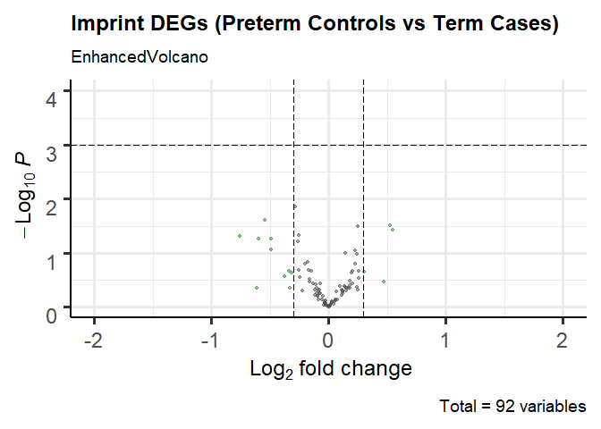
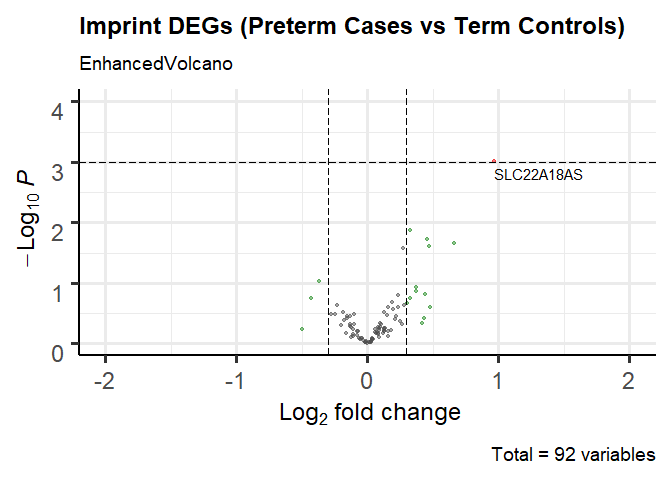
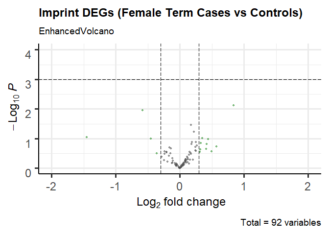
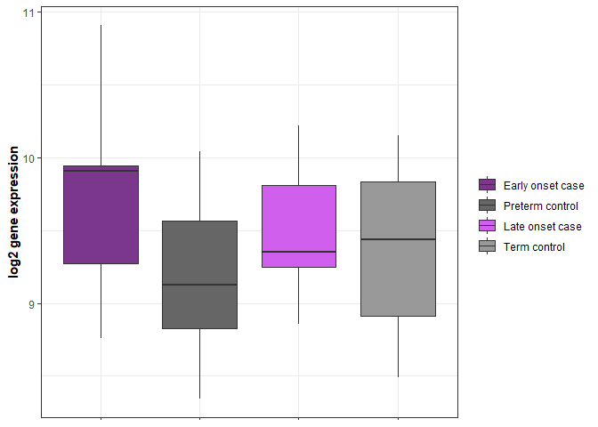
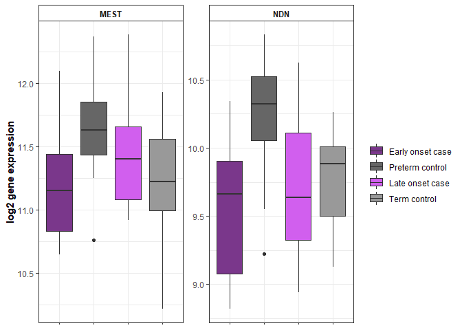

## R Markdown

This is an R Markdown document assessing differential gene expression in
the CoLab Nanostring dataset using the limma R package. This dataset
consists of 159 genes (92 Imprint, 8 Inflammation, 3 Methylation, 49
Neuro, 7 Placenta) assessed in 99 samples (19 Preterm control, 24
Preterm PE, 31 Term control, 25 Term PE). One subject \[1000156\] had
duplicate entries discrepant for maternal age \> one entry was retained
and maternal age was recoded as NA for this subject. Based on
demographic characteristics, preterm subjects varied by gestational age,
birthweight and race across case status. Term subjects did not vary
significantly by case status. Race was collapsed to white vs. nonwhite
(only 1 subject categorized as “Other”).

\#load required libraries

``` r
library(tidyverse)
library(tableone)
library(Hmisc)
library(limma)
library(EnhancedVolcano)
library(ggplot2)
```

\#Read in data files

``` r
totalnorm<-read.csv("NanoString_norm/house_norm_log_filtered.csv",header=T,check.names=F,row.names=1)
Covariates_1<-read.csv("../Data/Covariates_10_11_19.csv",header=T) #includes birth weight info
Covariates_2<-read.csv("../Data/Covariates_6_20.csv",header=T) #inludes parity and maternal age info
Batch<-read.csv("RawData/NanoString_batch.csv",header=T)

codeset<-read.csv("../../NHBCS_MKaragas/NanoString/Imprint_codeset.csv",header=T) 
```

\#Format datasets

``` r
totalnorm<-totalnorm[,order(names(totalnorm))]


Covariates<-Covariates_2%>%
  select(Pateint.ID, Sample.type,Est.GA.samp,birth.method,baby.gender,Race,parity,Maternal.age.at.delivery..years.)%>%
  left_join(Covariates_1,by=c('Pateint.ID','Est.GA.samp','Race','Sample.type','birth.method','baby.gender'='baby.sex'))%>%
  left_join(Batch,by=c(Pateint.ID='Study.ID'))%>%
rename(ID=Pateint.ID,GestAge=Est.GA.samp,Case.status=Sample.type,Delivery.method=birth.method,Infant.sex=baby.gender,Parity=parity,Maternal.age=Maternal.age.at.delivery..years.,Birthweight=baby.birth.weight,Batch=NanoString.Plate)%>%
  select(ID,Case.status,GestAge,Birthweight,Delivery.method,Infant.sex,Race,Parity,Maternal.age,Batch)%>%
  distinct(ID,.keep_all = T)%>% #drop extra maternal age entry for 1000156
  mutate(Race=ifelse(Race=="W","White","Nonwhite"),
         Race=factor(Race,levels=c('White',"Nonwhite")),
         Parity=factor(ifelse(Parity==0,0,1)),
         Delivery.method=factor(ifelse(Delivery.method=="C/S","C/S","Vaginal")),
         Maternal.age=ifelse(ID=='1000156',NA,Maternal.age),
         Batch=factor(Batch))%>%
  filter(ID%in%names(totalnorm))%>%
  arrange(ID)

all(Covariates$ID==names(totalnorm)) #TRUE
```

    ## [1] TRUE

``` r
#subset Nanostring data to imprinted genes
Imprint<-as.character(codeset$Gene[codeset$Category%in%c("Allelic Imbalance","Known Imprint","Putative Imprint")])
totalnorm_Imprint<-totalnorm[rownames(totalnorm)%in%Imprint,] #92 genes, 99 subjects
```

\#Generate Study table

``` r
myVars <- c("Case.status","GestAge","Birthweight","Delivery.method","Infant.sex",     
 "Race","Parity","Maternal.age","Batch")
catVars <- c("Case.status","Delivery.method","Infant.sex","Race","Parity","Batch")

Covariates_term<-Covariates%>%
  filter(grepl("Term",Covariates$Case.status)) #56

tab_term <- CreateTableOne(vars = myVars, data = Covariates_term, strata = "Case.status",factorVars = catVars,includeNA=TRUE)
print(tab_term,quote = FALSE, noSpaces = FALSE, showAllLevels=TRUE,missing=TRUE,catDigits=1,contDigits=1,pDigits=2)
```

    ##                           Stratified by Case.status
    ##                            level        Term control    Term PE         p    
    ##   n                                         31              25               
    ##   Case.status (%)          Term control     31 (100.0)       0 (  0.0)  <0.01
    ##                            Term PE           0 (  0.0)      25 (100.0)       
    ##   GestAge (mean (SD))                     39.2 (0.9)      39.0 (1.4)     0.39
    ##   Birthweight (mean (SD))               3312.2 (405.0)  3099.1 (547.9)   0.10
    ##   Delivery.method (%)      C/S               6 ( 19.4)       8 ( 32.0)   0.44
    ##                            Vaginal          25 ( 80.6)      17 ( 68.0)       
    ##   Infant.sex (%)           F                12 ( 38.7)       9 ( 36.0)   1.00
    ##                            M                19 ( 61.3)      16 ( 64.0)       
    ##   Race (%)                 White            25 ( 80.6)      19 ( 76.0)   0.93
    ##                            Nonwhite          6 ( 19.4)       6 ( 24.0)       
    ##   Parity (%)               0                26 ( 83.9)      22 ( 88.0)   0.96
    ##                            1                 5 ( 16.1)       3 ( 12.0)       
    ##   Maternal.age (mean (SD))                25.3 (4.8)      26.9 (5.9)     0.27
    ##   Batch (%)                1                 5 ( 16.1)       1 (  4.0)   0.86
    ##                            2                 3 (  9.7)       3 ( 12.0)       
    ##                            3                 2 (  6.5)       2 (  8.0)       
    ##                            4                 4 ( 12.9)       2 (  8.0)       
    ##                            5                 2 (  6.5)       3 ( 12.0)       
    ##                            6                 4 ( 12.9)       2 (  8.0)       
    ##                            7                 5 ( 16.1)       4 ( 16.0)       
    ##                            8                 3 (  9.7)       4 ( 16.0)       
    ##                            9                 3 (  9.7)       4 ( 16.0)       
    ##                           Stratified by Case.status
    ##                            test Missing
    ##   n                                    
    ##   Case.status (%)               0.0    
    ##                                        
    ##   GestAge (mean (SD))           0.0    
    ##   Birthweight (mean (SD))       0.0    
    ##   Delivery.method (%)           0.0    
    ##                                        
    ##   Infant.sex (%)                0.0    
    ##                                        
    ##   Race (%)                      0.0    
    ##                                        
    ##   Parity (%)                    0.0    
    ##                                        
    ##   Maternal.age (mean (SD))      0.0    
    ##   Batch (%)                     0.0    
    ##                                        
    ##                                        
    ##                                        
    ##                                        
    ##                                        
    ##                                        
    ##                                        
    ## 

``` r
tabMat_term <- print(tab_term,quote = FALSE, noSpaces = FALSE, showAllLevels=TRUE,printToggle = FALSE,catDigits=1,contDigits=1,pDigits=2)
## Save to a CSV file
write.csv(tabMat_term, file = "Tables/Study_Table_term.csv")

Covariates_preterm<-Covariates%>%
  filter(grepl("Preterm",Covariates$Case.status)) #43

tab_preterm <- CreateTableOne(vars = myVars, data = Covariates_preterm, strata = "Case.status",factorVars = catVars,includeNA=TRUE)
print(tab_preterm,quote = FALSE, noSpaces = FALSE, showAllLevels=TRUE,missing=TRUE,catDigits=1,contDigits=1,pDigits=2)
```

    ##                           Stratified by Case.status
    ##                            level           Preterm control Preterm PE     
    ##   n                                            19              24         
    ##   Case.status (%)          Preterm control     19 (100.0)       0 (  0.0) 
    ##                            Preterm PE           0 (  0.0)      24 (100.0) 
    ##   GestAge (mean (SD))                        34.6 (3.1)      32.4 (1.5)   
    ##   Birthweight (mean (SD))                  2351.8 (651.1)  1645.5 (508.6) 
    ##   Delivery.method (%)      C/S                  7 ( 36.8)      14 ( 58.3) 
    ##                            Vaginal             12 ( 63.2)      10 ( 41.7) 
    ##   Infant.sex (%)           F                    9 ( 47.4)      11 ( 45.8) 
    ##                            M                   10 ( 52.6)      13 ( 54.2) 
    ##   Race (%)                 White                6 ( 31.6)      18 ( 75.0) 
    ##                            Nonwhite            13 ( 68.4)       6 ( 25.0) 
    ##   Parity (%)               0                   12 ( 63.2)      18 ( 75.0) 
    ##                            1                    7 ( 36.8)       6 ( 25.0) 
    ##   Maternal.age (mean (SD))                   26.9 (5.6)      27.0 (6.8)   
    ##   Batch (%)                1                    1 (  5.3)       5 ( 20.8) 
    ##                            2                    2 ( 10.5)       3 ( 12.5) 
    ##                            3                    2 ( 10.5)       5 ( 20.8) 
    ##                            4                    1 (  5.3)       4 ( 16.7) 
    ##                            5                    4 ( 21.1)       2 (  8.3) 
    ##                            6                    4 ( 21.1)       1 (  4.2) 
    ##                            7                    0 (  0.0)       2 (  8.3) 
    ##                            8                    2 ( 10.5)       2 (  8.3) 
    ##                            9                    3 ( 15.8)       0 (  0.0) 
    ##                           Stratified by Case.status
    ##                            p     test Missing
    ##   n                                          
    ##   Case.status (%)          <0.01      0.0    
    ##                                              
    ##   GestAge (mean (SD))      <0.01      0.0    
    ##   Birthweight (mean (SD))  <0.01      0.0    
    ##   Delivery.method (%)       0.27      0.0    
    ##                                              
    ##   Infant.sex (%)            1.00      0.0    
    ##                                              
    ##   Race (%)                  0.01      0.0    
    ##                                              
    ##   Parity (%)                0.61      0.0    
    ##                                              
    ##   Maternal.age (mean (SD))  0.96      2.3    
    ##   Batch (%)                 0.11      0.0    
    ##                                              
    ##                                              
    ##                                              
    ##                                              
    ##                                              
    ##                                              
    ##                                              
    ## 

``` r
tabMat_preterm <- print(tab_preterm,quote = FALSE, noSpaces = FALSE, showAllLevels=TRUE,printToggle = FALSE,catDigits=1,contDigits=1,pDigits=2)
## Save to a CSV file
write.csv(tabMat_preterm, file = "Tables/Study_Table_preterm.csv")
```

\#Correlation among demographic variables of interest

``` r
#function to reorder cormat
reorder_cormat <- function(cormat){
# Use correlation between variables as distance
dd <- as.dist((1-cormat)/2)
hc <- hclust(dd)
cormat <-cormat[hc$order, hc$order]
}

#function to get upper triangle
get_upper_tri <- function(cormat){
    cormat[lower.tri(cormat)]<- NA
    return(cormat)
  }

#restrict to continuous variables
corr_set<-Covariates%>%
  select(GestAge,Birthweight,Maternal.age)%>%
  drop_na() #98 samples

corr_mat<-rcorr(as.matrix(corr_set),type="spearman")


corr<-round(corr_mat[["r"]], 2)
corr <- reorder_cormat(corr)
corr<-get_upper_tri(corr)

p_value <-round(corr_mat[["P"]], 2)


corr_gather<-as.data.frame(corr)%>%
            rownames_to_column(var='var1')%>%
            gather(var2,corr,-c(var1))
            #filter(!var1==var2)
                   
                   
p_gather<-as.data.frame(p_value)%>%
            rownames_to_column(var='var1')%>%
            gather(var2,p_value,-c(var1))
            #filter(!var1==var2)
  
corrplot<-corr_gather%>%
  left_join(p_gather,by=c('var1','var2'))


corr_fig<-ggplot(corrplot, aes(var2, var1, fill = corr))+
 geom_tile(color = "white")+
 scale_fill_gradient2(low = "blue", high = "red", mid = "white", 
   midpoint = 0, limit = c(-1,1), space = "Lab", 
    name="Spearman\nCorrelation") +
  theme_minimal()+ # minimal theme
 theme(axis.text.x = element_text(angle = 45, vjust = 1, 
    size = 12, hjust = 1))+
 coord_fixed() +
geom_text(aes(var2, var1, label = corr), color = "black", size = 4) +
theme(axis.title.x = element_blank(),
  axis.title.y = element_blank(),
  panel.grid.major = element_blank(),
  panel.border = element_blank(),
  panel.background = element_blank(),
  axis.ticks = element_blank(),
  legend.justification = c(1, 0))

corr_fig
```

    ## Warning: Removed 3 rows containing missing values (geom_text).

<!-- -->

``` r
pdf("Plots/Corr_BW_Gestage.pdf")
corr_fig
```

    ## Warning: Removed 3 rows containing missing values (geom_text).

``` r
dev.off()
```

    ## png 
    ##   2

\#Overall differential expression of imprinted genes using limma

``` r
#Using whole dataset for design matrix
all(Covariates$ID==names(totalnorm_Imprint)) #TRUE
```

    ## [1] TRUE

``` r
design<-model.matrix(~0+Case.status+GestAge+Race,data=Covariates)
colnames(design)<-c("Preterm_control","Preterm_PE","Term_control","Term_PE","GA","Race")

fit<-lmFit(totalnorm_Imprint,design)

cont.matrix<-makeContrasts(Preterm_PEvsC=Preterm_PE-Preterm_control,
                           Term_PEvsC=Term_PE-Term_control,
                           PCvsTC=Preterm_control-Term_control,
                           PPvsTP=Preterm_PE-Term_PE,
                           PPvsTC=Preterm_PE-Term_control,
                           PCvsTP=Preterm_control-Term_PE,
                           levels=design)

fit2<-contrasts.fit(fit,cont.matrix)
fit2<-eBayes(fit2)

topTable_preterm<-topTable(fit2,coef="Preterm_PEvsC", adjust = "fdr", sort.by="p", n=nrow(totalnorm_Imprint))
#MEST FDR = 0.01
#NDN FDR = 0.04

topTable_term<-topTable(fit2,coef="Term_PEvsC", adjust = "fdr", sort.by="p", n=nrow(totalnorm_Imprint))
#None

#alternative contrasts
topTable_PCvsTC<-topTable(fit2,coef="PCvsTC", adjust = "fdr", sort.by="p", n=nrow(totalnorm_Imprint))
#None

topTable_PPvsTP<-topTable(fit2,coef="PPvsTP", adjust = "fdr", sort.by="p", n=nrow(totalnorm_Imprint))
#None

topTable_PPvsTC<-topTable(fit2,coef="PPvsTC", adjust = "fdr", sort.by="p", n=nrow(totalnorm_Imprint))
#SLC22A18AS; FDR=0.09

topTable_PCvsTP<-topTable(fit2,coef="PCvsTP", adjust = "fdr", sort.by="p", n=nrow(totalnorm_Imprint))
#None

write.csv(topTable_preterm,file="limma/imprint_preterm_topTable.csv")
write.csv(topTable_term,file="limma/imprint_term_topTable.csv")
write.csv(topTable_PCvsTC,file="limma/imprint_PCvsTC_topTable.csv")
write.csv(topTable_PPvsTP,file="limma/imprint_PPvsTP_topTable.csv")
write.csv(topTable_PPvsTC,file="limma/imprint_PPvsTC_topTable.csv")
write.csv(topTable_PCvsTP,file="limma/imprint_PCvsTP_topTable.csv")


#Splitting design matrix into preterm and term subgroups
Covariates_term<-Covariates%>%
  filter(grepl("Term",Case.status))%>%
  mutate(Case.status=factor(Case.status))

totalnorm_Imprint_term<-totalnorm_Imprint%>%
  select(as.character(Covariates_term$ID))
all(Covariates_term$ID==names(totalnorm_Imprint_term)) #TRUE
```

    ## [1] TRUE

``` r
Covariates_preterm<-Covariates%>%
  filter(grepl("Preterm",Case.status))%>%
  mutate(Case.status=factor(Case.status))

totalnorm_Imprint_preterm<-totalnorm_Imprint%>%
  select(as.character(Covariates_preterm$ID))
all(Covariates_preterm$ID==names(totalnorm_Imprint_preterm)) #TRUE
```

    ## [1] TRUE

``` r
#PRETERM
design<-model.matrix(~0+Case.status+GestAge+Race,data=Covariates_preterm)
colnames(design)<-c("Preterm_control","Preterm_PE","GA","Race")

fit<-lmFit(totalnorm_Imprint_preterm,design)

cont.matrix<-makeContrasts(Preterm_PEvsC=Preterm_PE-Preterm_control,
                          levels=design)

fit2<-contrasts.fit(fit,cont.matrix)
fit2<-eBayes(fit2)

topTable_preterm2<-topTable(fit2,coef="Preterm_PEvsC", adjust = "fdr", sort.by="p")

#TERM
design<-model.matrix(~0+Case.status+GestAge+Race,data=Covariates_term)
colnames(design)<-c("Term_control","Term_PE","GA","Race")

fit<-lmFit(totalnorm_Imprint_term,design)

cont.matrix<-makeContrasts(Term_PEvsC=Term_PE-Term_control,
                          levels=design)

fit2<-contrasts.fit(fit,cont.matrix)
fit2<-eBayes(fit2)

topTable_term2<-topTable(fit2,coef="Term_PEvsC", adjust = "fdr", sort.by="p", n=nrow(totalnorm_Imprint))
```

\#Sex-stratified differential expression of imprinted genes using limma

``` r
#Male placenta
Covariates_male<-Covariates%>%
  filter(Infant.sex=="M")

totalnorm_Imprint_male<-totalnorm_Imprint%>%
  select(as.character(Covariates_male$ID))

all(Covariates_male$ID==names(totalnorm_Imprint_male)) #TRUE
```

    ## [1] TRUE

``` r
design<-model.matrix(~0+Case.status+GestAge+Race,data=Covariates_male)
colnames(design)<-c("Preterm_control","Preterm_PE","Term_control","Term_PE","GA","Race")

fit<-lmFit(totalnorm_Imprint_male,design)

cont.matrix<-makeContrasts(Preterm_PEvsC=Preterm_PE-Preterm_control,
                           Term_PEvsC=Term_PE-Term_control,
                           PCvsTC=Preterm_control-Term_control,
                           PPvsTP=Preterm_PE-Term_PE,
                           PPvsTC=Preterm_PE-Term_control,
                           PCvsTP=Preterm_control-Term_PE,
                           levels=design)

fit2<-contrasts.fit(fit,cont.matrix)
fit2<-eBayes(fit2)

topTable_preterm_male<-topTable(fit2,coef="Preterm_PEvsC", adjust = "fdr", sort.by="p", n=nrow(totalnorm_Imprint_male))
#None

topTable_term_male<-topTable(fit2,coef="Term_PEvsC", adjust = "fdr", sort.by="p", n=nrow(totalnorm_Imprint_male))
#None

write.csv(topTable_preterm_male,file="limma/imprint_preterm__male_topTable.csv")
write.csv(topTable_term_male,file="limma/imprint_term__male_topTable.csv")


#Female placenta
Covariates_female<-Covariates%>%
  filter(Infant.sex=="F")

totalnorm_Imprint_female<-totalnorm_Imprint%>%
  select(as.character(Covariates_female$ID))

all(Covariates_female$ID==names(totalnorm_Imprint_female)) #TRUE
```

    ## [1] TRUE

``` r
design<-model.matrix(~0+Case.status+GestAge+Race,data=Covariates_female)
colnames(design)<-c("Preterm_control","Preterm_PE","Term_control","Term_PE","GA","Race")

fit<-lmFit(totalnorm_Imprint_female,design)

cont.matrix<-makeContrasts(Preterm_PEvsC=Preterm_PE-Preterm_control,
                           Term_PEvsC=Term_PE-Term_control,
                           PCvsTC=Preterm_control-Term_control,
                           PPvsTP=Preterm_PE-Term_PE,
                           PPvsTC=Preterm_PE-Term_control,
                           PCvsTP=Preterm_control-Term_PE,
                           levels=design)

fit2<-contrasts.fit(fit,cont.matrix)
fit2<-eBayes(fit2)

topTable_preterm_female<-topTable(fit2,coef="Preterm_PEvsC", adjust = "fdr", sort.by="p", n=nrow(totalnorm_Imprint_female))
#MEST > FDR = 0.08

topTable_term_female<-topTable(fit2,coef="Term_PEvsC", adjust = "fdr", sort.by="p", n=nrow(totalnorm_Imprint_female))
#None

write.csv(topTable_preterm_female,file="limma/imprint_preterm__female_topTable.csv")
write.csv(topTable_term_female,file="limma/imprint_term__female_topTable.csv")
```

\#Differential expression of imprinted genes across sex (among term
controls)

``` r
Covariates_TC<-Covariates%>%
  filter(Case.status=="Term control")

totalnorm_Imprint_TC<-totalnorm_Imprint%>%
  select(as.character(Covariates_TC$ID))

all(Covariates_TC$ID==names(totalnorm_Imprint_TC)) #TRUE
```

    ## [1] TRUE

``` r
design<-model.matrix(~0+Infant.sex,data=Covariates_TC)
colnames(design)<-c("Female","Male")

fit<-lmFit(totalnorm_Imprint_TC,design)

cont.matrix<-makeContrasts(Term_FvsM=Female-Male,
                           levels=design)

fit2<-contrasts.fit(fit,cont.matrix)
fit2<-eBayes(fit2)

topTable_term_sex<-topTable(fit2,coef="Term_FvsM", adjust = "fdr", sort.by="p", n=nrow(totalnorm_Imprint_TC))
#None

write.csv(topTable_term_sex,file="limma/imprint_term_control_sex_topTable.csv")
```

\#volcano plot of imprinted DEGs

``` r
preterm_volcano<-EnhancedVolcano(topTable_preterm,
    lab = rownames(topTable_preterm),
    x = 'logFC',
    y = 'P.Value',
    title="Preterm Imprint DEGs",
    pCutoff = 0.0007,
    FCcutoff = 0.3,
    pointSize = 1.0,
    labSize = 4.0,
    legendPosition = 'none',
    xlim = c(-2,2),
    ylim=c(0,4))

preterm_volcano
```

<!-- -->

``` r
pdf("Plots/imprint_preterm_limma_volcano.pdf")
preterm_volcano
dev.off()
```

    ## png 
    ##   2

``` r
term_volcano<-EnhancedVolcano(topTable_term,
    lab = rownames(topTable_term),
    x = 'logFC',
    y = 'P.Value',
    title="Term Imprint DEGs",
    pCutoff = 0.0007,
    FCcutoff = 0.3,
    pointSize = 1.0,
    labSize = 4.0,
    legendPosition = 'none',
    xlim = c(-2, 2),
    ylim=c(0,4))

term_volcano
```

<!-- -->

``` r
pdf("Plots/imprint_term_limma_volcano.pdf")
term_volcano
dev.off()
```

    ## png 
    ##   2

``` r
control_volcano<-EnhancedVolcano(topTable_PCvsTC,
    lab = rownames(topTable_PCvsTC),
    x = 'logFC',
    y = 'P.Value',
    title="Imprint DEGs (Preterm vs Term Controls)",
    pCutoff = 0.0007,
    FCcutoff = 0.3,
    pointSize = 1.0,
    labSize = 4.0,
    legendPosition = 'none',
    xlim = c(-2, 2),
    ylim=c(0,4))

control_volcano
```

<!-- -->

``` r
pdf("Plots/imprint_PCvsTC_limma_volcano.pdf")
control_volcano
dev.off()
```

    ## png 
    ##   2

``` r
PCvsTC_volcano<-EnhancedVolcano(topTable_PCvsTP,
    lab = rownames(topTable_PCvsTP),
    x = 'logFC',
    y = 'P.Value',
    title="Imprint DEGs (Preterm Controls vs Term Cases)",
    pCutoff = 0.0007,
    FCcutoff = 0.3,
    pointSize = 1.0,
    labSize = 4.0,
    legendPosition = 'none',
    xlim = c(-2, 2),
    ylim=c(0,4))

PCvsTC_volcano
```

<!-- -->

``` r
pdf("Plots/imprint_PCvsTP_limma_volcano.pdf")
PCvsTC_volcano
dev.off()
```

    ## png 
    ##   2

``` r
PPvsTC<-EnhancedVolcano(topTable_PPvsTC,
    lab = rownames(topTable_PPvsTC),
    x = 'logFC',
    y = 'P.Value',
    title="Imprint DEGs (Preterm Cases vs Term Controls)",
    pCutoff = 0.0007,
    FCcutoff = 0.3,
    pointSize = 1.0,
    labSize = 4.0,
    legendPosition = 'none',
    xlim = c(-2, 2),
    ylim=c(0,4))

PPvsTC
```

<!-- -->

``` r
pdf("Plots/imprint_PPvsTC_limma_volcano.pdf")
PPvsTC
dev.off()
```

    ## png 
    ##   2

``` r
PPvsTP<-EnhancedVolcano(topTable_PCvsTC,
    lab = rownames(topTable_PCvsTC),
    x = 'logFC',
    y = 'P.Value',
    title="Imprint DEGs (Preterm vs Term Cases)",
    pCutoff = 0.0007,
    FCcutoff = 0.3,
    pointSize = 1.0,
    labSize = 4.0,
    legendPosition = 'none',
    xlim = c(-2, 2),
    ylim=c(0,4))

PPvsTP
```

<!-- -->

``` r
pdf("Plots/imprint_PPvsTP_limma_volcano.pdf")
PPvsTP
dev.off()
```

    ## png 
    ##   2

``` r
Female_term_volcano<-EnhancedVolcano(topTable_term_female,
    lab = rownames(topTable_term_female),
    x = 'logFC',
    y = 'P.Value',
    title="Imprint DEGs (Female Term Cases vs Female Term Control)",
    pCutoff = 0.0007,
    FCcutoff = 0.3,
    pointSize = 1.0,
    labSize = 4.0,
    legendPosition = 'none',
    xlim = c(-2, 2),
    ylim=c(0,4))

Female_term_volcano
```

<!-- -->

``` r
pdf("Plots/imprint_female_term_limma_volcano.pdf")
Female_term_volcano
dev.off()
```

    ## png 
    ##   2

``` r
Female_preterm_volcano<-EnhancedVolcano(topTable_preterm_female,
    lab = rownames(topTable_preterm_female),
    x = 'logFC',
    y = 'P.Value',
    title="Imprint DEGs (Female Preterm Cases vs Female Preterm Control)",
    pCutoff = 0.0007,
    FCcutoff = 0.3,
    pointSize = 1.0,
    labSize = 4.0,
    legendPosition = 'none',
    xlim = c(-2, 2),
    ylim=c(0,4))

Female_preterm_volcano
```

<!-- -->

``` r
pdf("Plots/imprint_female_preterm_limma_volcano.pdf")
Female_preterm_volcano
dev.off()
```

    ## png 
    ##   2

``` r
male_term_volcano<-EnhancedVolcano(topTable_term_male,
    lab = rownames(topTable_term_male),
    x = 'logFC',
    y = 'P.Value',
    title="Imprint DEGs (Male Term Cases vs Male Term Control)",
    pCutoff = 0.0007,
    FCcutoff = 0.3,
    pointSize = 1.0,
    labSize = 4.0,
    legendPosition = 'none',
    xlim = c(-2, 2),
    ylim=c(0,4))

male_term_volcano
```

<!-- -->

``` r
pdf("Plots/imprint_male_term_limma_volcano.pdf")
male_term_volcano
dev.off()
```

    ## png 
    ##   2

``` r
male_preterm_volcano<-EnhancedVolcano(topTable_preterm_male,
    lab = rownames(topTable_preterm_male),
    x = 'logFC',
    y = 'P.Value',
    title="Imprint DEGs (Male Preterm Cases vs Male Preterm Control)",
    pCutoff = 0.0007,
    FCcutoff = 0.3,
    pointSize = 1.0,
    labSize = 4.0,
    legendPosition = 'none',
    xlim = c(-2, 2),
    ylim=c(0,4))

male_preterm_volcano
```

<!-- -->

``` r
pdf("Plots/imprint_male_preterm_limma_volcano.pdf")
male_preterm_volcano
dev.off()
```

    ## png 
    ##   2

\#boxplot of most differentially expressed imprinted genes across case
status (MEST, NDN)

``` r
#Overall
Genes<-as.data.frame(t(totalnorm_Imprint))
Covariates$ID<-as.character(Covariates$ID)

Boxplots<-Genes%>%
  tibble::rownames_to_column()%>%
  mutate(ID=rowname)%>%
  left_join(Covariates)%>%
  select(ID,MEST,NDN,Case.status)%>%
  gather(Genes,Value,-c(ID,Case.status))
```

    ## Joining, by = "ID"

``` r
imprint_boxplot<-ggplot(Boxplots,aes(x=Case.status,y=Value,fill=Case.status))+
  geom_boxplot()+
  theme_bw()+
  labs(y="log2 gene expression")+
  theme(axis.text.x=element_blank(),
        axis.title.x=element_blank(),
        axis.title.y=element_text(face="bold"),
        legend.title = element_blank(),
        strip.background=element_rect(fill="white"),
        strip.text=element_text(face="bold"))+
  facet_wrap(~Genes,scales="free")

imprint_boxplot
```

<!-- -->

``` r
pdf("Plots/imprint_boxplot.pdf")
imprint_boxplot
dev.off() 
```

    ## png 
    ##   2

``` r
#DLX5 (based on prior literature)
DLX5_boxplot<-Genes%>%
  tibble::rownames_to_column()%>%
  mutate(ID=rowname)%>%
  left_join(Covariates)%>%
  select(ID,DLX5,Case.status)%>%
  ggplot(.,aes(x=Case.status,y=DLX5,fill=Case.status))+
  geom_boxplot()+
  theme_bw()+
  labs(y="log2 gene expression")+
  theme(axis.text.x=element_blank(),
        axis.title.x=element_blank(),
        axis.title.y=element_text(face="bold"),
        legend.title = element_blank(),
        strip.background=element_rect(fill="white"),
        strip.text=element_text(face="bold"))
```

    ## Joining, by = "ID"

``` r
DLX5_boxplot
```

<!-- -->

``` r
pdf("Plots/imprint_boxplot_DLX5.pdf")
DLX5_boxplot
dev.off()
```

    ## png 
    ##   2

``` r
#Females
Genes<-as.data.frame(t(totalnorm_Imprint_female))
Covariates_female$ID<-as.character(Covariates_female$ID)

Boxplots<-Genes%>%
  tibble::rownames_to_column()%>%
  mutate(ID=rowname)%>%
  left_join(Covariates_female)%>%
  select(ID,MEST,NDN,Case.status)%>%
  gather(Genes,Value,-c(ID,Case.status))
```

    ## Joining, by = "ID"

``` r
female_imprint_boxplot<-ggplot(Boxplots,aes(x=Case.status,y=Value,fill=Case.status))+
  geom_boxplot()+
  theme_bw()+
  labs(y="log2 gene expression")+
  theme(axis.text.x=element_blank(),
        axis.title.x=element_blank(),
        axis.title.y=element_text(face="bold"),
        legend.title = element_blank(),
        strip.background=element_rect(fill="white"),
        strip.text=element_text(face="bold"))+
  facet_wrap(~Genes,scales="free")

female_imprint_boxplot
```

<!-- -->

``` r
pdf("Plots/imprint_boxplot_female.pdf")
female_imprint_boxplot
dev.off()  
```

    ## png 
    ##   2

``` r
female_DLX5_boxplot<-Genes%>%
  tibble::rownames_to_column()%>%
  mutate(ID=rowname)%>%
  left_join(Covariates_female)%>%
  select(ID,DLX5,Case.status)%>%
  drop_na()%>% #drop males
  ggplot(.,aes(x=Case.status,y=DLX5,fill=Case.status))+
  geom_boxplot()+
  theme_bw()+
  labs(y="log2 gene expression")+
  theme(axis.text.x=element_blank(),
        axis.title.x=element_blank(),
        axis.title.y=element_text(face="bold"),
        legend.title = element_blank(),
        strip.background=element_rect(fill="white"),
        strip.text=element_text(face="bold"))
```

    ## Joining, by = "ID"

``` r
female_DLX5_boxplot
```

<!-- -->

``` r
pdf("Plots/imprint_boxplot_female_DLX5.pdf")
female_DLX5_boxplot
dev.off()
```

    ## png 
    ##   2

``` r
#Males
Genes<-as.data.frame(t(totalnorm_Imprint_male))
Covariates_male$ID<-as.character(Covariates_male$ID)

Boxplots<-Genes%>%
  tibble::rownames_to_column()%>%
  mutate(ID=rowname)%>%
  left_join(Covariates_male)%>%
  select(ID,MEST,NDN,Case.status)%>%
  gather(Genes,Value,-c(ID,Case.status))
```

    ## Joining, by = "ID"

``` r
male_imprint_boxplot<-ggplot(Boxplots,aes(x=Case.status,y=Value,fill=Case.status))+
  geom_boxplot()+
  theme_bw()+
  labs(y="log2 gene expression")+
  theme(axis.text.x=element_blank(),
        axis.title.x=element_blank(),
        axis.title.y=element_text(face="bold"),
        legend.title = element_blank(),
        strip.background=element_rect(fill="white"),
        strip.text=element_text(face="bold"))+
  facet_wrap(~Genes,scales="free")

male_imprint_boxplot
```

<!-- -->

``` r
pdf("Plots/imprint_boxplot_male.pdf")
male_imprint_boxplot
dev.off()  
```

    ## png 
    ##   2

``` r
male_DLX5_boxplot<-Genes%>%
  tibble::rownames_to_column()%>%
  mutate(ID=rowname)%>%
  left_join(Covariates_male)%>%
  select(ID,DLX5,Case.status)%>%
  drop_na()%>% #drop females
  ggplot(.,aes(x=Case.status,y=DLX5,fill=Case.status))+
  geom_boxplot()+
  theme_bw()+
  labs(y="log2 gene expression")+
  theme(axis.text.x=element_blank(),
        axis.title.x=element_blank(),
        axis.title.y=element_text(face="bold"),
        legend.title = element_blank(),
        strip.background=element_rect(fill="white"),
        strip.text=element_text(face="bold"))
```

    ## Joining, by = "ID"

``` r
male_DLX5_boxplot
```

<!-- -->

``` r
pdf("Plots/imprint_boxplot_male_DLX5.pdf")
male_DLX5_boxplot
dev.off()
```

    ## png 
    ##   2
