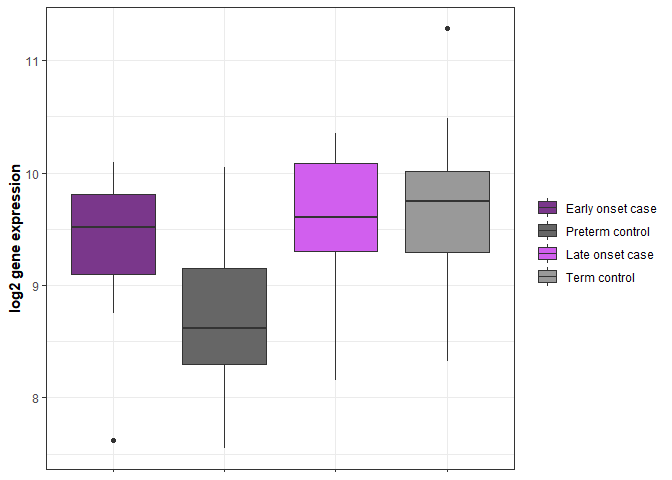

## R Markdown summary

This is an R Markdown document assessing differential gene expression in
the CoLab Nanostring dataset using the limma R package. This dataset
focuses on 92 imprinted genes assessed in 99 samples (19 Preterm
control, 24 Preterm PE, 31 Term control, 25 Term PE). One subject
\[1000156\] had duplicate entries discrepant for maternal age \> one of
the two entries was retained and maternal age was recoded as NA for this
subject. Based on demographic characteristics, preterm subjects varied
by gestational age, birthweight and race across case status. Term
subjects did not vary significantly by case status. Race was collapsed
to white vs. nonwhite (only 1 subject categorized as “Other”).

## Load required libraries

``` r
library(tidyverse)
library(tableone)
library(Hmisc)
library(limma)
library(EnhancedVolcano)
library(ggplot2)
```

## Read in data files

``` r
totalnorm<-read.csv("NanoString_norm/house_norm_log_filtered.csv",header=T,check.names=F,row.names=1)
Covariates_1<-read.csv("../Data/Covariates_10_11_19.csv",header=T) #includes birth weight info
Covariates_2<-read.csv("../Data/Covariates_6_20.csv",header=T) #inludes parity and maternal age info
Batch<-read.csv("RawData/NanoString_batch.csv",header=T)

codeset<-read.csv("../../NHBCS_MKaragas/NanoString/Imprint_codeset.csv",header=T) 
```

## Format datasets

``` r
totalnorm<-totalnorm[,order(names(totalnorm))]


Covariates<-Covariates_2%>%
  select(Pateint.ID, Sample.type,Est.GA.samp,birth.method,baby.gender,Race,parity,Maternal.age.at.delivery..years.)%>%
  left_join(Covariates_1,by=c('Pateint.ID','Est.GA.samp','Race','Sample.type','birth.method','baby.gender'='baby.sex'))%>%
  left_join(Batch,by=c(Pateint.ID='Study.ID'))%>%
rename(ID=Pateint.ID,GestAge=Est.GA.samp,Case.status=Sample.type,Delivery.method=birth.method,Infant.sex=baby.gender,Parity=parity,Maternal.age=Maternal.age.at.delivery..years.,Birthweight=baby.birth.weight,Batch=NanoString.Plate)%>%
  select(ID,Case.status,GestAge,Birthweight,Delivery.method,Infant.sex,Race,Parity,Maternal.age,Batch)%>%
  distinct(ID,.keep_all = T)%>% #drop extra maternal age entry for 1000156
  mutate(Race=ifelse(Race=="W","White","Nonwhite"),
         Race=factor(Race,levels=c('White',"Nonwhite")),
         Parity=factor(ifelse(Parity==0,0,1)),
         Delivery.method=factor(ifelse(Delivery.method=="C/S","C/S","Vaginal")),
         Maternal.age=ifelse(ID=='1000156',NA,Maternal.age),
         Batch=factor(Batch))%>%
  filter(ID%in%names(totalnorm))%>%
  arrange(ID)

all(Covariates$ID==names(totalnorm)) #TRUE
```

    ## [1] TRUE

``` r
#subset Nanostring data to imprinted genes
Imprint<-as.character(codeset$Gene[codeset$Category%in%c("Allelic Imbalance","Known Imprint","Putative Imprint")])
totalnorm_Imprint<-totalnorm[rownames(totalnorm)%in%Imprint,] #92 genes, 99 subjects
```

## Generate Study table

``` r
myVars <- c("Case.status","GestAge","Birthweight","Delivery.method","Infant.sex",     
 "Race","Parity","Maternal.age","Batch")
catVars <- c("Case.status","Delivery.method","Infant.sex","Race","Parity","Batch")

Covariates_term<-Covariates%>%
  filter(grepl("Term",Covariates$Case.status)) #56

tab_term <- CreateTableOne(vars = myVars, data = Covariates_term, strata = "Case.status",factorVars = catVars,includeNA=TRUE)
print(tab_term,quote = FALSE, noSpaces = FALSE, showAllLevels=TRUE,missing=TRUE,catDigits=1,contDigits=1,pDigits=2)
```

    ##                           Stratified by Case.status
    ##                            level        Term control    Term PE         p    
    ##   n                                         31              25               
    ##   Case.status (%)          Term control     31 (100.0)       0 (  0.0)  <0.01
    ##                            Term PE           0 (  0.0)      25 (100.0)       
    ##   GestAge (mean (SD))                     39.2 (0.9)      39.0 (1.4)     0.39
    ##   Birthweight (mean (SD))               3312.2 (405.0)  3099.1 (547.9)   0.10
    ##   Delivery.method (%)      C/S               6 ( 19.4)       8 ( 32.0)   0.44
    ##                            Vaginal          25 ( 80.6)      17 ( 68.0)       
    ##   Infant.sex (%)           F                12 ( 38.7)       9 ( 36.0)   1.00
    ##                            M                19 ( 61.3)      16 ( 64.0)       
    ##   Race (%)                 White            25 ( 80.6)      19 ( 76.0)   0.93
    ##                            Nonwhite          6 ( 19.4)       6 ( 24.0)       
    ##   Parity (%)               0                26 ( 83.9)      22 ( 88.0)   0.96
    ##                            1                 5 ( 16.1)       3 ( 12.0)       
    ##   Maternal.age (mean (SD))                25.3 (4.8)      26.9 (5.9)     0.27
    ##   Batch (%)                1                 5 ( 16.1)       1 (  4.0)   0.86
    ##                            2                 3 (  9.7)       3 ( 12.0)       
    ##                            3                 2 (  6.5)       2 (  8.0)       
    ##                            4                 4 ( 12.9)       2 (  8.0)       
    ##                            5                 2 (  6.5)       3 ( 12.0)       
    ##                            6                 4 ( 12.9)       2 (  8.0)       
    ##                            7                 5 ( 16.1)       4 ( 16.0)       
    ##                            8                 3 (  9.7)       4 ( 16.0)       
    ##                            9                 3 (  9.7)       4 ( 16.0)       
    ##                           Stratified by Case.status
    ##                            test Missing
    ##   n                                    
    ##   Case.status (%)               0.0    
    ##                                        
    ##   GestAge (mean (SD))           0.0    
    ##   Birthweight (mean (SD))       0.0    
    ##   Delivery.method (%)           0.0    
    ##                                        
    ##   Infant.sex (%)                0.0    
    ##                                        
    ##   Race (%)                      0.0    
    ##                                        
    ##   Parity (%)                    0.0    
    ##                                        
    ##   Maternal.age (mean (SD))      0.0    
    ##   Batch (%)                     0.0    
    ##                                        
    ##                                        
    ##                                        
    ##                                        
    ##                                        
    ##                                        
    ##                                        
    ## 

``` r
tabMat_term <- print(tab_term,quote = FALSE, noSpaces = FALSE, showAllLevels=TRUE,printToggle = FALSE,catDigits=1,contDigits=1,pDigits=2)
## Save to a CSV file
write.csv(tabMat_term, file = "Tables/Study_Table_term.csv")

Covariates_preterm<-Covariates%>%
  filter(grepl("Preterm",Covariates$Case.status)) #43

tab_preterm <- CreateTableOne(vars = myVars, data = Covariates_preterm, strata = "Case.status",factorVars = catVars,includeNA=TRUE)
print(tab_preterm,quote = FALSE, noSpaces = FALSE, showAllLevels=TRUE,missing=TRUE,catDigits=1,contDigits=1,pDigits=2)
```

    ##                           Stratified by Case.status
    ##                            level           Preterm control Preterm PE     
    ##   n                                            19              24         
    ##   Case.status (%)          Preterm control     19 (100.0)       0 (  0.0) 
    ##                            Preterm PE           0 (  0.0)      24 (100.0) 
    ##   GestAge (mean (SD))                        34.6 (3.1)      32.4 (1.5)   
    ##   Birthweight (mean (SD))                  2351.8 (651.1)  1645.5 (508.6) 
    ##   Delivery.method (%)      C/S                  7 ( 36.8)      14 ( 58.3) 
    ##                            Vaginal             12 ( 63.2)      10 ( 41.7) 
    ##   Infant.sex (%)           F                    9 ( 47.4)      11 ( 45.8) 
    ##                            M                   10 ( 52.6)      13 ( 54.2) 
    ##   Race (%)                 White                6 ( 31.6)      18 ( 75.0) 
    ##                            Nonwhite            13 ( 68.4)       6 ( 25.0) 
    ##   Parity (%)               0                   12 ( 63.2)      18 ( 75.0) 
    ##                            1                    7 ( 36.8)       6 ( 25.0) 
    ##   Maternal.age (mean (SD))                   26.9 (5.6)      27.0 (6.8)   
    ##   Batch (%)                1                    1 (  5.3)       5 ( 20.8) 
    ##                            2                    2 ( 10.5)       3 ( 12.5) 
    ##                            3                    2 ( 10.5)       5 ( 20.8) 
    ##                            4                    1 (  5.3)       4 ( 16.7) 
    ##                            5                    4 ( 21.1)       2 (  8.3) 
    ##                            6                    4 ( 21.1)       1 (  4.2) 
    ##                            7                    0 (  0.0)       2 (  8.3) 
    ##                            8                    2 ( 10.5)       2 (  8.3) 
    ##                            9                    3 ( 15.8)       0 (  0.0) 
    ##                           Stratified by Case.status
    ##                            p     test Missing
    ##   n                                          
    ##   Case.status (%)          <0.01      0.0    
    ##                                              
    ##   GestAge (mean (SD))      <0.01      0.0    
    ##   Birthweight (mean (SD))  <0.01      0.0    
    ##   Delivery.method (%)       0.27      0.0    
    ##                                              
    ##   Infant.sex (%)            1.00      0.0    
    ##                                              
    ##   Race (%)                  0.01      0.0    
    ##                                              
    ##   Parity (%)                0.61      0.0    
    ##                                              
    ##   Maternal.age (mean (SD))  0.96      2.3    
    ##   Batch (%)                 0.11      0.0    
    ##                                              
    ##                                              
    ##                                              
    ##                                              
    ##                                              
    ##                                              
    ##                                              
    ## 

``` r
tabMat_preterm <- print(tab_preterm,quote = FALSE, noSpaces = FALSE, showAllLevels=TRUE,printToggle = FALSE,catDigits=1,contDigits=1,pDigits=2)
## Save to a CSV file
write.csv(tabMat_preterm, file = "Tables/Study_Table_preterm.csv")
```

## Correlation among demographic variables of interest

``` r
#function to reorder cormat
reorder_cormat <- function(cormat){
# Use correlation between variables as distance
dd <- as.dist((1-cormat)/2)
hc <- hclust(dd)
cormat <-cormat[hc$order, hc$order]
}

#function to get upper triangle
get_upper_tri <- function(cormat){
    cormat[lower.tri(cormat)]<- NA
    return(cormat)
  }

#restrict to continuous variables
corr_set<-Covariates%>%
  select(GestAge,Birthweight,Maternal.age)%>%
  drop_na() #98 samples

corr_mat<-rcorr(as.matrix(corr_set),type="spearman")


corr<-round(corr_mat[["r"]], 2)
corr <- reorder_cormat(corr)
corr<-get_upper_tri(corr)

p_value <-round(corr_mat[["P"]], 2)


corr_gather<-as.data.frame(corr)%>%
            rownames_to_column(var='var1')%>%
            gather(var2,corr,-c(var1))
            #filter(!var1==var2)
                   
                   
p_gather<-as.data.frame(p_value)%>%
            rownames_to_column(var='var1')%>%
            gather(var2,p_value,-c(var1))
            #filter(!var1==var2)
  
corrplot<-corr_gather%>%
  left_join(p_gather,by=c('var1','var2'))


corr_fig<-ggplot(corrplot, aes(var2, var1, fill = corr))+
 geom_tile(color = "white")+
 scale_fill_gradient2(low = "blue", high = "red", mid = "white", 
   midpoint = 0, limit = c(-1,1), space = "Lab", 
    name="Spearman\nCorrelation") +
  theme_minimal()+ # minimal theme
 theme(axis.text.x = element_text(angle = 45, vjust = 1, 
    size = 12, hjust = 1))+
 coord_fixed() +
geom_text(aes(var2, var1, label = corr), color = "black", size = 4) +
theme(axis.title.x = element_blank(),
  axis.title.y = element_blank(),
  panel.grid.major = element_blank(),
  panel.border = element_blank(),
  panel.background = element_blank(),
  axis.ticks = element_blank(),
  legend.justification = c(1, 0))

corr_fig
```

<!-- -->

``` r
pdf("Plots/Corr_BW_Gestage.pdf")
corr_fig
dev.off()
```

    ## png 
    ##   2

## Overall differential expression of imprinted genes using limma

``` r
#Using whole dataset for design matrix
all(Covariates$ID==names(totalnorm_Imprint)) #TRUE
```

    ## [1] TRUE

``` r
design<-model.matrix(~0+Case.status+GestAge+Race,data=Covariates)
colnames(design)<-c("Preterm_control","Preterm_PE","Term_control","Term_PE","GA","Race")

fit<-lmFit(totalnorm_Imprint,design)

cont.matrix<-makeContrasts(Preterm_PEvsC=Preterm_PE-Preterm_control,
                           Term_PEvsC=Term_PE-Term_control,
                           PCvsTC=Preterm_control-Term_control,
                           PPvsTP=Preterm_PE-Term_PE,
                           PPvsTC=Preterm_PE-Term_control,
                           PCvsTP=Preterm_control-Term_PE,
                           levels=design)

fit2<-contrasts.fit(fit,cont.matrix)
fit2<-eBayes(fit2)

topTable_preterm<-topTable(fit2,coef="Preterm_PEvsC", adjust = "fdr", sort.by="p", n=nrow(totalnorm_Imprint))
topTable_preterm[1:5,]
```

    ##            logFC   AveExpr         t      P.Value  adj.P.Val          B
    ## MEST  -0.5504170 11.382586 -3.943622 0.0001518637 0.01397146  0.7141930
    ## NDN   -0.5493043  9.803632 -3.474330 0.0007677778 0.03531778 -0.7699059
    ## BMPR2  0.3031994  9.263532  3.120957 0.0023763234 0.07287392 -1.7912071
    ## IGF2R  0.2797980  8.629422  2.782738 0.0064813638 0.14785076 -2.6847633
    ## DLX5   0.5875023  9.443525  2.684146 0.0085545511 0.14785076 -2.9289913

``` r
topTable_term<-topTable(fit2,coef="Term_PEvsC", adjust = "fdr", sort.by="p", n=nrow(totalnorm_Imprint))
topTable_term[1:5,]
```

    ##              logFC  AveExpr         t    P.Value adj.P.Val         B
    ## ATP10A   0.4278281 5.064315  2.459204 0.01569956 0.7771278 -3.552940
    ## NEDD9    0.2037434 9.832482  2.202809 0.02998116 0.7771278 -3.810771
    ## ZC3H12C -0.2264760 5.924460 -1.890447 0.06168938 0.7771278 -4.091807
    ## PRIM2   -0.1423378 6.333793 -1.861099 0.06576507 0.7771278 -4.116266
    ## ZFAT    -0.2944615 9.421816 -1.860538 0.06584513 0.7771278 -4.116730

``` r
#alternative contrasts
topTable_PCvsTC<-topTable(fit2,coef="PCvsTC", adjust = "fdr", sort.by="p", n=nrow(totalnorm_Imprint))
topTable_PCvsTC[1:5,]
```

    ##                 logFC   AveExpr         t     P.Value adj.P.Val         B
    ## SLC22A18AS  0.7557290  5.241732  3.126524 0.002335877 0.2149007 -1.537961
    ## THSD7A     -0.6647568 10.883162 -2.144240 0.034518017 0.7720905 -3.669654
    ## UBE3A      -0.2611062  8.958013 -2.141346 0.034756902 0.7720905 -3.674907
    ## SLC22A18    0.5358706  5.627333  2.053041 0.042766506 0.7720905 -3.832094
    ## MEST        0.3199749 11.382586  1.956580 0.053278391 0.7720905 -3.996925

``` r
topTable_PPvsTP<-topTable(fit2,coef="PPvsTP", adjust = "fdr", sort.by="p", n=nrow(totalnorm_Imprint))
topTable_PPvsTP[1:5,]
```

    ##                logFC   AveExpr        t    P.Value adj.P.Val         B
    ## SLC22A18AS 0.7380944  5.241732 2.613475 0.01039315 0.4981296 -4.019260
    ## PHLDA2     0.4688974  9.267886 2.462599 0.01556060 0.4981296 -4.093239
    ## BLCAP      0.2914731 10.438665 2.446173 0.01624336 0.4981296 -4.101085
    ## NNAT       0.6520817  7.220852 2.311198 0.02294329 0.5276957 -4.163967
    ## CDKN1C     0.4223437 12.362881 2.057618 0.04231538 0.7786030 -4.274140

``` r
topTable_PPvsTC<-topTable(fit2,coef="PPvsTC", adjust = "fdr", sort.by="p", n=nrow(totalnorm_Imprint))
topTable_PPvsTC[1:5,]
```

    ##                logFC   AveExpr        t      P.Value  adj.P.Val          B
    ## SLC22A18AS 0.9694698  5.241732 3.401711 0.0009748082 0.08968236 -0.8325639
    ## LIN28B     0.3231747 10.597006 2.524035 0.0132287334 0.40397746 -3.0837466
    ## PHLDA2     0.4601187  9.267886 2.394653 0.0185614137 0.40397746 -3.3674639
    ## NNAT       0.6621242  7.220852 2.325580 0.0221285337 0.40397746 -3.5135443
    ## CDKN1C     0.4734313 12.362881 2.285664 0.0244551583 0.40397746 -3.5962324

``` r
topTable_PCvsTP<-topTable(fit2,coef="PCvsTP", adjust = "fdr", sort.by="p", n=nrow(totalnorm_Imprint))
topTable_PCvsTP[1:5,]
```

    ##                 logFC  AveExpr         t    P.Value adj.P.Val         B
    ## BMPR2      -0.2825202 9.263532 -2.499852 0.01410635  0.569632 -3.934573
    ## SHANK2     -0.5428438 8.921500 -2.285230 0.02448160  0.569632 -4.063503
    ## SLC22A18AS  0.5243536 5.241732  2.184979 0.03130383  0.569632 -4.120472
    ## PRIM2       0.2513232 6.333793  2.170080 0.03244769  0.569632 -4.128757
    ## SLC22A18    0.5484446 5.627333  2.116399 0.03687598  0.569632 -4.158211

``` r
write.csv(topTable_preterm,file="limma/imprint_preterm_topTable.csv")
write.csv(topTable_term,file="limma/imprint_term_topTable.csv")
write.csv(topTable_PCvsTC,file="limma/imprint_PCvsTC_topTable.csv")
write.csv(topTable_PPvsTP,file="limma/imprint_PPvsTP_topTable.csv")
write.csv(topTable_PPvsTC,file="limma/imprint_PPvsTC_topTable.csv")
write.csv(topTable_PCvsTP,file="limma/imprint_PCvsTP_topTable.csv")
```

## Sex-stratified differential expression of imprinted genes using limma

``` r
#Male placenta
Covariates_male<-Covariates%>%
  filter(Infant.sex=="M")

totalnorm_Imprint_male<-totalnorm_Imprint%>%
  select(as.character(Covariates_male$ID))

all(Covariates_male$ID==names(totalnorm_Imprint_male)) #TRUE
```

    ## [1] TRUE

``` r
design<-model.matrix(~0+Case.status+GestAge+Race,data=Covariates_male)
colnames(design)<-c("Preterm_control","Preterm_PE","Term_control","Term_PE","GA","Race")

fit<-lmFit(totalnorm_Imprint_male,design)

cont.matrix<-makeContrasts(Preterm_PEvsC=Preterm_PE-Preterm_control,
                           Term_PEvsC=Term_PE-Term_control,
                           PCvsTC=Preterm_control-Term_control,
                           PPvsTP=Preterm_PE-Term_PE,
                           PPvsTC=Preterm_PE-Term_control,
                           PCvsTP=Preterm_control-Term_PE,
                           levels=design)

fit2<-contrasts.fit(fit,cont.matrix)
fit2<-eBayes(fit2)

topTable_preterm_male<-topTable(fit2,coef="Preterm_PEvsC", adjust = "fdr", sort.by="p", n=nrow(totalnorm_Imprint_male))
topTable_preterm_male[1:5,]
```

    ##              logFC  AveExpr         t    P.Value adj.P.Val         B
    ## NEDD9    0.4849895 9.815340  2.583279 0.01243016 0.5104777 -4.177278
    ## GDNF    -0.8805599 5.718944 -2.500232 0.01537180 0.5104777 -4.206468
    ## ANKRD11  0.3258547 8.360087  2.294786 0.02552297 0.5104777 -4.276028
    ## PRIM2   -0.3513387 6.293619 -2.218989 0.03056461 0.5104777 -4.300673
    ## IGF2AS   0.6123903 5.607789  2.210179 0.03120418 0.5104777 -4.303500

``` r
topTable_term_male<-topTable(fit2,coef="Term_PEvsC", adjust = "fdr", sort.by="p", n=nrow(totalnorm_Imprint_male))
topTable_term_male[1:5,]
```

    ##              logFC  AveExpr         t     P.Value adj.P.Val         B
    ## CPA4    -0.6255192 5.060867 -3.101289 0.003017846 0.2776419 -1.761317
    ## INPP5F  -0.2920178 8.861624 -2.482110 0.016092004 0.4607784 -3.034554
    ## NEDD9    0.2887940 9.815340  2.464307 0.016829074 0.4607784 -3.068066
    ## GLIS3    0.6688178 5.514400  2.394250 0.020033843 0.4607784 -3.198124
    ## TRAPPC9 -0.2615059 7.115968 -2.171965 0.034116952 0.6277519 -3.590999

``` r
write.csv(topTable_preterm_male,file="limma/imprint_preterm__male_topTable.csv")
write.csv(topTable_term_male,file="limma/imprint_term__male_topTable.csv")


#Female placenta
Covariates_female<-Covariates%>%
  filter(Infant.sex=="F")

totalnorm_Imprint_female<-totalnorm_Imprint%>%
  select(as.character(Covariates_female$ID))

all(Covariates_female$ID==names(totalnorm_Imprint_female)) #TRUE
```

    ## [1] TRUE

``` r
design<-model.matrix(~0+Case.status+GestAge+Race,data=Covariates_female)
colnames(design)<-c("Preterm_control","Preterm_PE","Term_control","Term_PE","GA","Race")

fit<-lmFit(totalnorm_Imprint_female,design)

cont.matrix<-makeContrasts(Preterm_PEvsC=Preterm_PE-Preterm_control,
                           Term_PEvsC=Term_PE-Term_control,
                           PCvsTC=Preterm_control-Term_control,
                           PPvsTP=Preterm_PE-Term_PE,
                           PPvsTC=Preterm_PE-Term_control,
                           PCvsTP=Preterm_control-Term_PE,
                           levels=design)

fit2<-contrasts.fit(fit,cont.matrix)
fit2<-eBayes(fit2)

topTable_preterm_female<-topTable(fit2,coef="Preterm_PEvsC", adjust = "fdr", sort.by="p", n=nrow(totalnorm_Imprint_female))
topTable_preterm_female[1:5,]
```

    ##               logFC   AveExpr         t      P.Value  adj.P.Val          B
    ## MEST     -0.6100752 11.447698 -3.832735 0.0004535646 0.04172795 -0.1263306
    ## CDKN1C    0.4822958 12.362563  2.668459 0.0110728488 0.36536379 -3.0146698
    ## COPG2IT1 -0.5743076  6.949162 -2.639149 0.0119140368 0.36536379 -3.0791551
    ## DLX5      0.6154103  9.448793  2.250716 0.0301611555 0.44103956 -3.8855286
    ## PLAGL1   -0.4038745 11.175817 -2.230471 0.0315867437 0.44103956 -3.9249534

``` r
topTable_term_female<-topTable(fit2,coef="Term_PEvsC", adjust = "fdr", sort.by="p", n=nrow(totalnorm_Imprint_female))
topTable_term_female[1:5,]
```

    ##             logFC   AveExpr         t     P.Value adj.P.Val         B
    ## ATP10A  0.8356459  5.041531  2.822843 0.007478682 0.5113317 -3.824932
    ## OSBPL5 -0.5794759  4.405425 -2.666909 0.011115907 0.5113317 -3.910708
    ## NHP2L1  0.1765358 10.779181  2.194320 0.034282232 0.9260226 -4.155538
    ## ZNF597  0.2226462  7.047702  1.951327 0.058283451 0.9260226 -4.270196
    ## CPXM2  -1.4498628  6.587447 -1.738868 0.090007970 0.9260226 -4.362779

``` r
write.csv(topTable_preterm_female,file="limma/imprint_preterm__female_topTable.csv")
write.csv(topTable_term_female,file="limma/imprint_term__female_topTable.csv")
```

## Differential expression of imprinted genes across sex (among term controls)

``` r
Covariates_TC<-Covariates%>%
  filter(Case.status=="Term control")

totalnorm_Imprint_TC<-totalnorm_Imprint%>%
  select(as.character(Covariates_TC$ID))

all(Covariates_TC$ID==names(totalnorm_Imprint_TC)) #TRUE
```

    ## [1] TRUE

``` r
design<-model.matrix(~0+Infant.sex,data=Covariates_TC)
colnames(design)<-c("Female","Male")

fit<-lmFit(totalnorm_Imprint_TC,design)

cont.matrix<-makeContrasts(Term_FvsM=Female-Male,
                           levels=design)

fit2<-contrasts.fit(fit,cont.matrix)
fit2<-eBayes(fit2)

topTable_term_sex<-topTable(fit2,coef="Term_FvsM", adjust = "fdr", sort.by="p", n=nrow(totalnorm_Imprint_TC))
topTable_term_sex[1:5,]
```

    ##             logFC   AveExpr         t     P.Value  adj.P.Val         B
    ## MEG3    0.4297125 12.205188  3.386110 0.001866957 0.08874627 -1.260616
    ## NNAT    0.5036150  7.100267  3.373880 0.001929267 0.08874627 -1.288624
    ## CPA4   -0.6433357  5.288394 -2.965995 0.005614633 0.11852971 -2.195467
    ## OSBPL5  0.5164303  4.490718  2.880396 0.006974669 0.11852971 -2.378216
    ## LIN28B  0.2413293 10.504105  2.819828 0.008117926 0.11852971 -2.505740

``` r
write.csv(topTable_term_sex,file="limma/imprint_term_control_sex_topTable.csv")
```

## Volcano plot of imprinted DEGs

``` r
preterm_volcano<-EnhancedVolcano(topTable_preterm,
    lab = rownames(topTable_preterm),
    x = 'logFC',
    y = 'P.Value',
    title="Preterm Imprint DEGs",
    pCutoff = 0.001,
    FCcutoff = 0.3,
    pointSize = 1.0,
    labSize = 4.0,
    legendPosition = 'none',
    xlim = c(-2,2),
    ylim=c(0,4))

preterm_volcano
```

<!-- -->

``` r
pdf("Plots/imprint_preterm_limma_volcano.pdf")
preterm_volcano
dev.off()
```

    ## png 
    ##   2

``` r
term_volcano<-EnhancedVolcano(topTable_term,
    lab = rownames(topTable_term),
    x = 'logFC',
    y = 'P.Value',
    title="Term Imprint DEGs",
    pCutoff = 0.001,
    FCcutoff = 0.3,
    pointSize = 1.0,
    labSize = 4.0,
    legendPosition = 'none',
    xlim = c(-2, 2),
    ylim=c(0,4))

term_volcano
```

<!-- -->

``` r
pdf("Plots/imprint_term_limma_volcano.pdf")
term_volcano
dev.off()
```

    ## png 
    ##   2

``` r
control_volcano<-EnhancedVolcano(topTable_PCvsTC,
    lab = rownames(topTable_PCvsTC),
    x = 'logFC',
    y = 'P.Value',
    title="Imprint DEGs (Preterm vs Term Controls)",
    pCutoff = 0.001,
    FCcutoff = 0.3,
    pointSize = 1.0,
    labSize = 4.0,
    legendPosition = 'none',
    xlim = c(-2, 2),
    ylim=c(0,4))

control_volcano
```

<!-- -->

``` r
pdf("Plots/imprint_PCvsTC_limma_volcano.pdf")
control_volcano
dev.off()
```

    ## png 
    ##   2

``` r
PCvsTC_volcano<-EnhancedVolcano(topTable_PCvsTP,
    lab = rownames(topTable_PCvsTP),
    x = 'logFC',
    y = 'P.Value',
    title="Imprint DEGs (Preterm Controls vs Term Cases)",
    pCutoff = 0.001,
    FCcutoff = 0.3,
    pointSize = 1.0,
    labSize = 4.0,
    legendPosition = 'none',
    xlim = c(-2, 2),
    ylim=c(0,4))

PCvsTC_volcano
```

<!-- -->

``` r
pdf("Plots/imprint_PCvsTP_limma_volcano.pdf")
PCvsTC_volcano
dev.off()
```

    ## png 
    ##   2

``` r
PPvsTC<-EnhancedVolcano(topTable_PPvsTC,
    lab = rownames(topTable_PPvsTC),
    x = 'logFC',
    y = 'P.Value',
    title="Imprint DEGs (Preterm Cases vs Term Controls)",
    pCutoff = 0.001,
    FCcutoff = 0.3,
    pointSize = 1.0,
    labSize = 4.0,
    legendPosition = 'none',
    xlim = c(-2, 2),
    ylim=c(0,4))

PPvsTC
```

<!-- -->

``` r
pdf("Plots/imprint_PPvsTC_limma_volcano.pdf")
PPvsTC
dev.off()
```

    ## png 
    ##   2

``` r
PPvsTP<-EnhancedVolcano(topTable_PCvsTC,
    lab = rownames(topTable_PCvsTC),
    x = 'logFC',
    y = 'P.Value',
    title="Imprint DEGs (Preterm vs Term Cases)",
    pCutoff = 0.001,
    FCcutoff = 0.3,
    pointSize = 1.0,
    labSize = 4.0,
    legendPosition = 'none',
    xlim = c(-2, 2),
    ylim=c(0,4))

PPvsTP
```

<!-- -->

``` r
pdf("Plots/imprint_PPvsTP_limma_volcano.pdf")
PPvsTP
dev.off()
```

    ## png 
    ##   2

``` r
Female_term_volcano<-EnhancedVolcano(topTable_term_female,
    lab = rownames(topTable_term_female),
    x = 'logFC',
    y = 'P.Value',
    title="Imprint DEGs (Female Term Cases vs Controls)",
    pCutoff = 0.001,
    FCcutoff = 0.3,
    pointSize = 1.0,
    labSize = 4.0,
    legendPosition = 'none',
    xlim = c(-2, 2),
    ylim=c(0,4))

Female_term_volcano
```

<!-- -->

``` r
pdf("Plots/imprint_female_term_limma_volcano.pdf")
Female_term_volcano
dev.off()
```

    ## png 
    ##   2

``` r
Female_preterm_volcano<-EnhancedVolcano(topTable_preterm_female,
    lab = rownames(topTable_preterm_female),
    x = 'logFC',
    y = 'P.Value',
    title="Imprint DEGs (Female Preterm Cases vs Controls)",
    pCutoff = 0.001,
    FCcutoff = 0.3,
    pointSize = 1.0,
    labSize = 4.0,
    legendPosition = 'none',
    xlim = c(-2, 2),
    ylim=c(0,4))

Female_preterm_volcano
```

<!-- -->

``` r
pdf("Plots/imprint_female_preterm_limma_volcano.pdf")
Female_preterm_volcano
dev.off()
```

    ## png 
    ##   2

``` r
male_term_volcano<-EnhancedVolcano(topTable_term_male,
    lab = rownames(topTable_term_male),
    x = 'logFC',
    y = 'P.Value',
    title="Imprint DEGs (Male Term Cases vs Controls)",
    pCutoff = 0.001,
    FCcutoff = 0.3,
    pointSize = 1.0,
    labSize = 4.0,
    legendPosition = 'none',
    xlim = c(-2, 2),
    ylim=c(0,4))

male_term_volcano
```

<!-- -->

``` r
pdf("Plots/imprint_male_term_limma_volcano.pdf")
male_term_volcano
dev.off()
```

    ## png 
    ##   2

``` r
male_preterm_volcano<-EnhancedVolcano(topTable_preterm_male,
    lab = rownames(topTable_preterm_male),
    x = 'logFC',
    y = 'P.Value',
    title="Imprint DEGs (Male Preterm Cases vs Controls)",
    pCutoff = 0.001,
    FCcutoff = 0.3,
    pointSize = 1.0,
    labSize = 4.0,
    legendPosition = 'none',
    xlim = c(-2, 2),
    ylim=c(0,4))

male_preterm_volcano
```

<!-- -->

``` r
pdf("Plots/imprint_male_preterm_limma_volcano.pdf")
male_preterm_volcano
dev.off()
```

    ## png 
    ##   2

## Boxplot of most differentially expressed imprinted genes across case status (MEST, NDN)

``` r
#Overall
Genes<-as.data.frame(t(totalnorm_Imprint))
Covariates$ID<-as.character(Covariates$ID)

Boxplots<-Genes%>%
  tibble::rownames_to_column()%>%
  mutate(ID=rowname)%>%
  left_join(Covariates)%>%
  select(ID,MEST,NDN,Case.status)%>%
  gather(Genes,Value,-c(ID,Case.status))

imprint_boxplot<-ggplot(Boxplots,aes(x=Case.status,y=Value,fill=Case.status))+
  geom_boxplot()+
  theme_bw()+
  labs(y="log2 gene expression")+
  theme(axis.text.x=element_blank(),
        axis.title.x=element_blank(),
        axis.title.y=element_text(face="bold"),
        legend.title = element_blank(),
        strip.background=element_rect(fill="white"),
        strip.text=element_text(face="bold"))+
  facet_wrap(~Genes,scales="free")

imprint_boxplot
```

<!-- -->

``` r
pdf("Plots/imprint_boxplot.pdf")
imprint_boxplot
dev.off() 
```

    ## png 
    ##   2

``` r
#DLX5 (based on prior literature)
DLX5_boxplot<-Genes%>%
  tibble::rownames_to_column()%>%
  mutate(ID=rowname)%>%
  left_join(Covariates)%>%
  select(ID,DLX5,Case.status)%>%
  ggplot(.,aes(x=Case.status,y=DLX5,fill=Case.status))+
  geom_boxplot()+
  theme_bw()+
  labs(y="log2 gene expression")+
  theme(axis.text.x=element_blank(),
        axis.title.x=element_blank(),
        axis.title.y=element_text(face="bold"),
        legend.title = element_blank(),
        strip.background=element_rect(fill="white"),
        strip.text=element_text(face="bold"))

DLX5_boxplot
```

<!-- -->

``` r
pdf("Plots/imprint_boxplot_DLX5.pdf")
DLX5_boxplot
dev.off()
```

    ## png 
    ##   2

``` r
#Females
Genes<-as.data.frame(t(totalnorm_Imprint_female))
Covariates_female$ID<-as.character(Covariates_female$ID)

Boxplots<-Genes%>%
  tibble::rownames_to_column()%>%
  mutate(ID=rowname)%>%
  left_join(Covariates_female)%>%
  select(ID,MEST,NDN,Case.status)%>%
  gather(Genes,Value,-c(ID,Case.status))


female_imprint_boxplot<-ggplot(Boxplots,aes(x=Case.status,y=Value,fill=Case.status))+
  geom_boxplot()+
  theme_bw()+
  labs(y="log2 gene expression")+
  theme(axis.text.x=element_blank(),
        axis.title.x=element_blank(),
        axis.title.y=element_text(face="bold"),
        legend.title = element_blank(),
        strip.background=element_rect(fill="white"),
        strip.text=element_text(face="bold"))+
  facet_wrap(~Genes,scales="free")

female_imprint_boxplot
```

<!-- -->

``` r
pdf("Plots/imprint_boxplot_female.pdf")
female_imprint_boxplot
dev.off()  
```

    ## png 
    ##   2

``` r
female_DLX5_boxplot<-Genes%>%
  tibble::rownames_to_column()%>%
  mutate(ID=rowname)%>%
  left_join(Covariates_female)%>%
  select(ID,DLX5,Case.status)%>%
  drop_na()%>% #drop males
  ggplot(.,aes(x=Case.status,y=DLX5,fill=Case.status))+
  geom_boxplot()+
  theme_bw()+
  labs(y="log2 gene expression")+
  theme(axis.text.x=element_blank(),
        axis.title.x=element_blank(),
        axis.title.y=element_text(face="bold"),
        legend.title = element_blank(),
        strip.background=element_rect(fill="white"),
        strip.text=element_text(face="bold"))


female_DLX5_boxplot
```

<!-- -->

``` r
pdf("Plots/imprint_boxplot_female_DLX5.pdf")
female_DLX5_boxplot
dev.off()
```

    ## png 
    ##   2

``` r
#Males
Genes<-as.data.frame(t(totalnorm_Imprint_male))
Covariates_male$ID<-as.character(Covariates_male$ID)

Boxplots<-Genes%>%
  tibble::rownames_to_column()%>%
  mutate(ID=rowname)%>%
  left_join(Covariates_male)%>%
  select(ID,MEST,NDN,Case.status)%>%
  gather(Genes,Value,-c(ID,Case.status))


male_imprint_boxplot<-ggplot(Boxplots,aes(x=Case.status,y=Value,fill=Case.status))+
  geom_boxplot()+
  theme_bw()+
  labs(y="log2 gene expression")+
  theme(axis.text.x=element_blank(),
        axis.title.x=element_blank(),
        axis.title.y=element_text(face="bold"),
        legend.title = element_blank(),
        strip.background=element_rect(fill="white"),
        strip.text=element_text(face="bold"))+
  facet_wrap(~Genes,scales="free")

male_imprint_boxplot
```

<!-- -->

``` r
pdf("Plots/imprint_boxplot_male.pdf")
male_imprint_boxplot
dev.off()  
```

    ## png 
    ##   2

``` r
male_DLX5_boxplot<-Genes%>%
  tibble::rownames_to_column()%>%
  mutate(ID=rowname)%>%
  left_join(Covariates_male)%>%
  select(ID,DLX5,Case.status)%>%
  drop_na()%>% #drop females
  ggplot(.,aes(x=Case.status,y=DLX5,fill=Case.status))+
  geom_boxplot()+
  theme_bw()+
  labs(y="log2 gene expression")+
  theme(axis.text.x=element_blank(),
        axis.title.x=element_blank(),
        axis.title.y=element_text(face="bold"),
        legend.title = element_blank(),
        strip.background=element_rect(fill="white"),
        strip.text=element_text(face="bold"))

male_DLX5_boxplot
```

<!-- -->

``` r
pdf("Plots/imprint_boxplot_male_DLX5.pdf")
male_DLX5_boxplot
dev.off()
```

    ## png 
    ##   2
